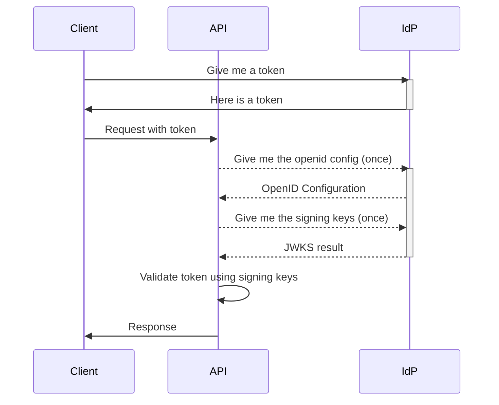
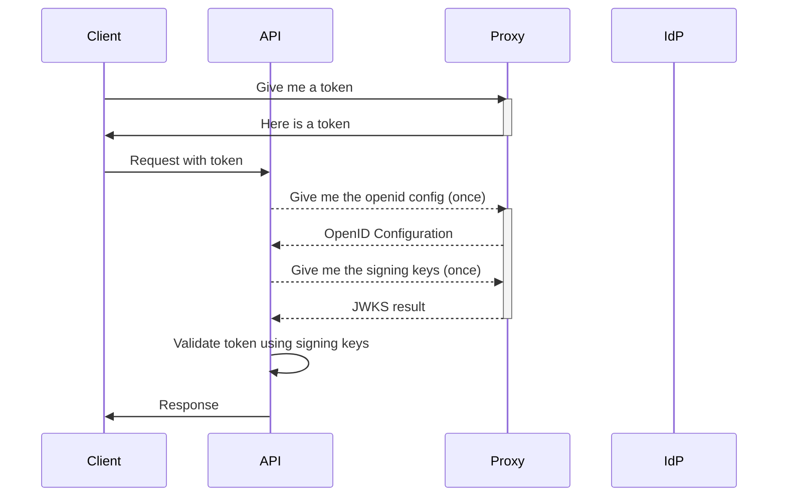

# IdentityProxy

IdentityProxy is a proxy that sits between your API (protected with tokens from an IdP) and your Identity Provider (IdP) to provide a way to mock tokens during integration tests.

## Normal operation

During normal operation the client requests a token from the IdP, then uses that token to make requests to the API. The API validates the token using the IdP's public keys.

## Integration testing

During integration testing you will need to test multiple user roles and scenarios. This can be difficult or cumbersome with a real IdP, where you would have to manage all the different credentials. IdentityProxy allows you to mock the `.well-known/openid-configuration` endpoint, to change the `jwks_uri` to point to the proxy. The proxy will then return the read public keys from the IdP, and inject an additional certificate to be able to generate any tokens you need for testing.

