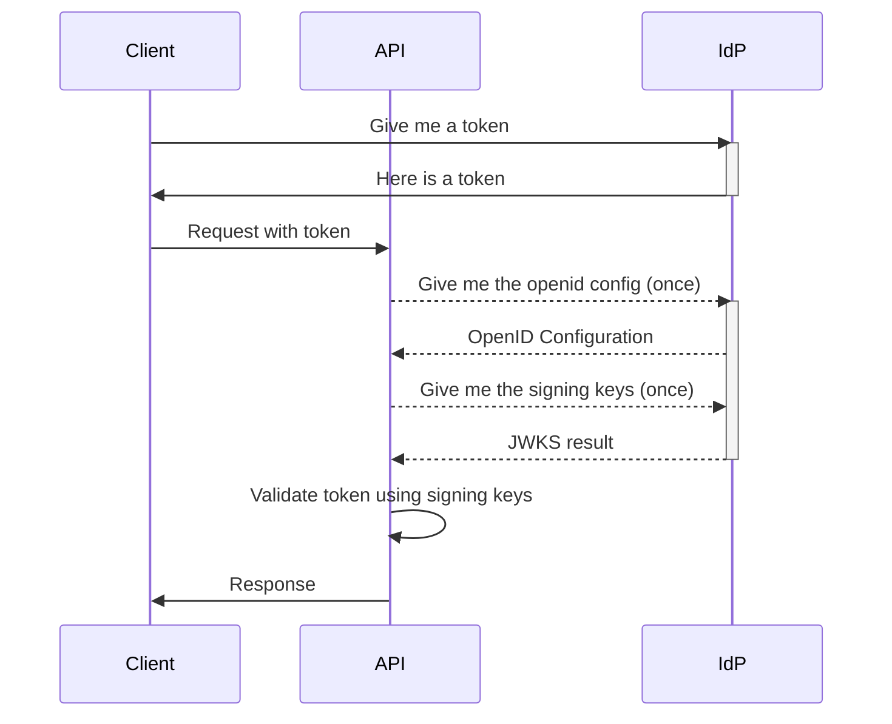
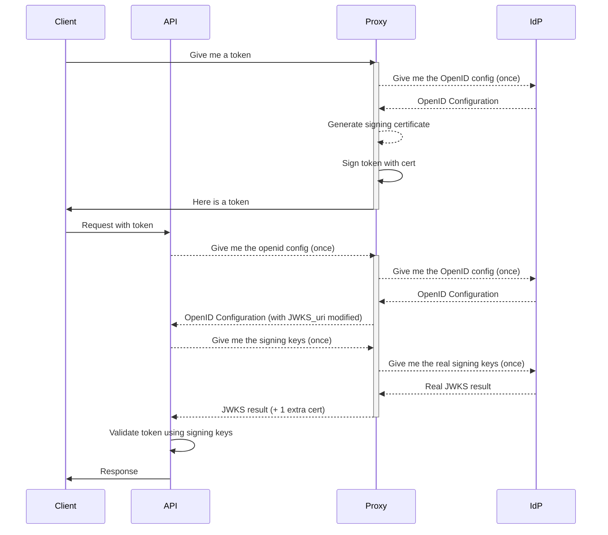

# IdentityProxy

IdentityProxy is a proxy that sits between your API (protected with tokens from an IdP) and your Identity Provider (IdP) to provide a way to mock tokens during integration tests. [More details here](#how-does-it-work).

## Usage

The best way to use IdentityProxy is the run it as a [TestContainer](https://www.testcontainers.org/).
This way you can start the proxy in your test setup, and it will be automatically stopped when the tests are done.

Check out [this example project](https://github.com/svrooij/demo-api-with-auth/tree/main/tests/Svrooij.Demo.Api.Tests) on how to test a protected API using IdentityProxy as TestContainer and the `WebApplicationFactory`.

### TestContainer .NET

[Nuget package](https://www.nuget.org/packages/SvRooij.Testcontainers.IdentityProxy)

```csharp
using Testcontainers.IdentityProxy;

var identityProxy = new IdentityProxyBuilder()
    .WithAuthority("https://login.microsoftonline.com/svrooij.io/v2.0/")
    .Build();

await identityProxy.StartAsync();

Console.WriteLine($"Well known config at: {identityProxy.GetAuthority()}.well-known/openid-configuration");
// At this point you should configure your api to use the value from identityProxy.GetAuthority() as the authority in the JWT middleware.

Console.WriteLine($"You can request a token by posting to {identityProxy.GetAuthority()}api/identity/token");
// Or by using identityProxy.GetTokenAsync(...)
var tokenResult = await identityProxy.GetTokenAsync(new TokenRequest
{
    Audience = "https://api.svrooij.io",
    Subject = "test",
    AdditionalClaims = new Dictionary<string, object>
    {
        { "scope", "openid profile email" }
    }
});

Console.WriteLine($"Token: {tokenResult?.AccessToken}");

Console.ReadLine();

await identityProxy.DisposeAsync();
```

### Docker

The IdentityProxy is just a [Docker container](https://github.com/svrooij/identityproxy/pkgs/container/identityproxy) `ghcr.io/svrooij/identityproxy:latest`. You can run it with the following command:

```bash
docker run -p 8080:8080 -e EXTERNAL_URL='http://localhost:8080/' -e IDENTITY_AUTHORITY='https://login.microsoftonline.com/svrooij.io/v2.0/' ghcr.io/svrooij/identityproxy:latest
```

The `EXTERNAL_URL` is the URL where the proxy is reachable from the outside. The `IDENTITY_AUTHORITY` is the base URL of the IdP to mock. The proxy will then listen on port 8080 and forward requests to the IdP.

### Get a mocked token

If you want a token you can request it from the `/api/identity/token` endpoint. The token will be signed with a certificate that is generated on startup. This certificate (the public key) is also injected in the JWKS response (so the server will accept the tokens as if they were real).

```http
POST http://localhost:8080/api/identity/token
Accept: application/json
Content-Type: application/json

{
  "aud": "62eb2412-f410-4e23-95e7-6a91146bc32c",
  "sub": "99f0cbaa-b3bb-4a77-81a5-e8d17b2232ec",
  "expires_in": 3600,
  "additional_claim_1": "value1",
  "additional_claim_2": "value2"
}
```

The `sub` (Subject) claim is required, everything else is optional.
Microsoft Entra also uses the `aud` (Audience) claim, so this is always set in the token.
Any additional claims you provide will be added to the token.
The `nbf` (Not Before) and `exp` (Expiration) claims are automatically added to the token, you can however control the lifetime of the token by providing the `expires_in` parameter, with the number of seconds you want to token to be valid.

And you'll get a response like this:

```json
{
  "access_token": "::token::",
  "expires_in": 3600,
}
```

### Duplicate a real token

If you have a real token, and you want a not expired version of it, you can post it to the `/api/identity/duplicate-token` endpoint.
The proxy will decode the token, and create a new token with the same claims, but with a new expiration time.

> For security reasons, you should make sure to strip of part of the signature, or to replace the signature with a dummy value!

```http
POST http://localhost:8080/api/identity/duplicate-token
Accept: application/json
Content-Type: application/json

{
  "token": "eyJhbGciOiJSUzI1NiIsImtpZCI6ImZqQjMzS1E2OGhoQk5OSUZUMERuS3Roa3g1dURtaV9RWEpENGhnTGVUMEUiLCJ0eXAiOiJKV1QifQ.eyJhdWQiOiI2MmViMjQxMi1mNDEwLTRlMjMtOTVlNy02YTkxMTQ2YmMzMmMiLCJpc3MiOiJodHRwczovL2xvZ2luLm1pY3Jvc29mdG9ubGluZS5jb20vZGY2OGFhMDMtNDhlYi00YjA5LTlmM2UtOGFlY2M1OGUyMDdjL3YyLjAiLCJleHAiOjE3NjA0Njg2MzAsImlhdCI6MTc2MDQ2NTAzMCwibmJmIjoxNzYwNDY1MDIwLCJzdWIiOiI5OWYwY2JhYS1iM2JiLTRhNzctODFhNS1lOGQxN2IyMjMyZWMiLCJzdXBlcl9zcGVjaWFsX2NsYWltIjoiYmxhYmxhIn0",
}
```

This will give you the same answer as above.


## How does it work?

API authentication these days is mostly done with Json Web Tokens, since they are stateless and don't require a database lookup for each request. This means that the API needs to have the public keys of the IdP to validate the tokens. The IdP provides these keys in a JWKS (Json Web Key Set) endpoint, which the API can use to validate the tokens. Most backends can be configured by just specifying the Authority (the base URL of the IdP) and the Audience (the client ID of the API). The backend will then fetch the JWKS from the IdP and use it to validate the tokens. First it loads the **OpenID Configuration** from a well-known endpoint (`/.well-known/openid-configuration`), which contains the URL of the JWKS endpoint. Then it fetches the **Json Web Key Set** from the JWKS endpoint, which contains the public keys.

### JWT Authentication flow

During normal operation the client requests a token from the IdP, then uses that token to make requests to the API. The API validates the token using the IdP's public keys. Check [this image](./docs/assets/jwt-authentication.svg) if the flow won't show up.



### JWT Authentication flow with IdentityProxy

During integration testing you will need to test multiple user roles and scenarios. This can be difficult or cumbersome with a real IdP, where you would have to manage all the different credentials. IdentityProxy allows you to mock the `.well-known/openid-configuration` endpoint, to change the `jwks_uri` to point to the proxy. The proxy will then return the real public keys from the IdP, and inject an additional certificate to be able to generate any tokens you need for testing. Check [this image](./docs/assets/jwt-authentication-with-proxy.svg) if the flow won't show up.



## Developer notes

I've tried my best to make the proxy as fast as possible, by enabling [Native AOT](https://learn.microsoft.com/aspnet/core/fundamentals/native-aot?view=aspnetcore-8.0&wt.mc_id=SEC-MVP-5004985) and packaging it in a [chiseled](https://devblogs.microsoft.com/dotnet/announcing-dotnet-chiseled-containers/) docker image.

Having an OpenAPI spec would be nice, but is seems there is an issue with [Swashbuckle and AOT](https://github.com/domaindrivendev/Swashbuckle.AspNetCore/commit/61d890c8dcefe292c8c4582670d24c8f6bf90ce7).

And the root url should return a fancy page with some info about the proxy, if someone would actually open it in their browser.
